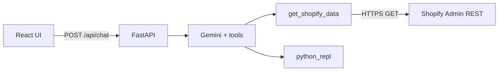

# Shopify Store Analyst (AI Agent)

Full-stack assignment project: a **tool-using AI agent** answers merchant questions using the **Shopify Admin REST API** (GET-only) and a **Python AST REPL** for analysis. Backend is **FastAPI**; frontend is **React (Vite)**.

## Architecture

- **Frontend (`frontend/`)**: Chat UI only; renders markdown replies (tables, images if the model embeds data-URI charts).
- **Backend (`backend/`)**:
  - `POST /api/chat` accepts `message` and prior `history`.
  - Uses `SHOPIFY_SHOP_NAME` and `SHOPIFY_ACCESS_TOKEN` from the server environment (single-store agent).
  - Runs a **Gemini** chat model with bound tools:
    - `get_shopify_data`: wraps the custom Shopify client (GET-only, pagination, 429 retries).
    - `python_repl`: `PythonAstREPLTool` for aggregates / tables / optional plotting.
  - Sanitizes assistant text to reduce accidental fenced code leaking to the UI.



## Setup

### Prerequisites

- **Python 3.11+** recommended (Python 3.14+ may require newer LangChain releases; this repo avoids `langchain.agents` for compatibility).
- **Node.js 20+** (for Vite).

### Backend

```powershell
cd backend
python -m venv .venv
.\.venv\Scripts\Activate.ps1
python -m pip install -r requirements.txt
```

Create `backend/.env` (you can copy the repo root `.env.example`). Required variables:

- `SHOPIFY_SHOP_NAME`
- `SHOPIFY_ACCESS_TOKEN`
- `SHOPIFY_API_VERSION` (defaults to `2025-07` in code if unset in some paths—prefer setting explicitly)
- `GEMINI_API_KEY`

Run:

```powershell
cd backend
python -m uvicorn app.main:app --reload --host 127.0.0.1 --port 8000
```

### Frontend

```powershell
cd frontend
npm install
npm run dev
```

The Vite dev server proxies `/api` and `/health` to `http://127.0.0.1:8000`.

### Agent prompt

The system prompt lives in `backend/app/agent_service.py` as `AGENT_SYSTEM_PROMPT`, and Shopify/tool logic lives in `backend/app/shopify.py`.

## Example questions

See `PRESETS.md` for the official sample list, including:


- “Which products sold the most last 7 month?”
- “Which products are top sellers this month?”


